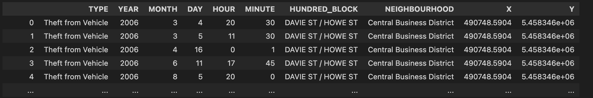
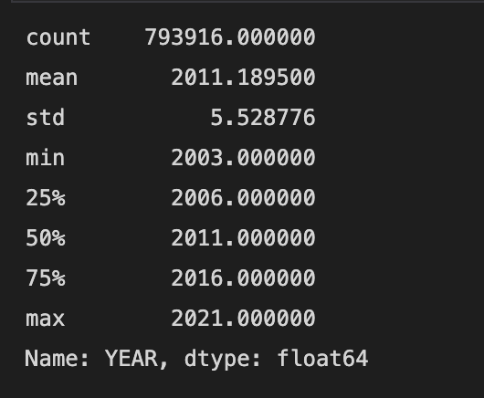

# Group 11 Final Report

## Introduction

The dataset selected for this project is created by Sumaia P. and is posted on Kaggle. The data collection lists Vancouver's historical crime data from 2003 to 2021. The table shows the type of crime, the year, month, date, hour, and minute that they occurred, the location (hundred block) and neighborhood of the crime scene, and the x and y coordinate values projected in UTM zone 10. This collection has been released to the public by the Vancouver Police Department (VPD) with the intention of enhancing community awareness of policing activities in the city. The data provided is based on the information contained in the VPD Records Management System. Unfortunately, there is no information on how the data was collected. Still, it can be speculated that the values are based on historical records that have been digitized, as the historical crime data of past years are likely archived into a dataset such as this.

We are very interested to find out the historical crime trends in Vancouver, as it is a city we visit often, and some of us are even planning to move there in the future. By gaining more awareness, we will be able to be more prepared to avoid encountering these crimes. The crime data will also likely be a valuable reference for the police department of Vancouver to predict crimes that may occur in the future and prepare means to handle them better.

The questions that we would be exploring are:

1. Does the total crime committed during the holiday season increase or decrease? (Luca)
2. At what times and years do the crimes occur the most? (Ken)
3. What types of crimes occur in which Neighbourhood, and which neighbourhood is arguably the safest? (Adnan)

## Explatory Data Analysis

### Question 1 (Does the total crime committed during the holiday season increase or decrease?)
#### **1. Understanding the Variables**

Here we see The data set that I was working with. It has 10 columns containing *TYPE* of crime commited, The *Year* the crime was commited, The *Month* the crime was commited,The  *Date* the crime was commited, the *Hour* the crime was commited, the  *Minute* the crime was commited, *Hundred_block*, the  *Neighborhood* the crime was commited, and the *X* and *Y* cordinates of the crime. Although this table only shows repeate varibales there are more unqiue variables in the data set.

Here we get more information about the dataset that tells us 1. how big our data set is and 2. how many Non-Null values we have. As we can see that data set countains 793916 crimes commited.With that we can see here is that in the columns *TYPE*, *YEAR*, *MONTH*, *DAY*, *HOUR*, and *MINUTE*, we do not have any missing values. While The blocks and coordinate columns have NULL values but, not enough Null values to make a significant difference in our research questions. 

The table above is of the year column. This table may not be seen as very useful. However, it shows us that the information given to us had occured between the times of 2003 and 2021. This gievs us a brakground of information of almost 2 decades. 

Here we can see the amount of crimes, the amount of unqiue crimes commited(The different types of crimes in the dataset), most common crimes, and frequency of the most common crimes between 2003 and 2021 in vancouver. As we can see there are 11 different Types of crimes that the dataset identifies. The most common crime in vancouver is theft from a vehicle and it had occured 224662 times out of the 793916 crimes commited in vancouver. From this we know that about 28 % of crimes reported in vancouver are Theft from a vehicle. 

As we found out from the table ahead there are 11 different types of crimes that is recorded in the datatable. Here is a list of all 11 types of crimes. This information can tell us alot about the type of crimes commited in vancouver. 

Lastley here is a break down about how many of each type of crimes is commited during the 2003 - 2021. Ths tables also lists in order how common each crime is with theft of vehicle being the most common and Homicide being the least common crime in vancouver.

#### **2. Cleaning the Dataset**

Cleaning the dataset will better help me with finding the answer to my question of " Does the total crime committed during the holiday season Increase?" What is ment by cleaning is getting rid of any uncessary information within the data set that I do not need. Because tehre are very few NULL values stated before and no NULL values in the columns that I need I will not have to get ride of and rows. 

So to get started I wanna get ride of the columns that I will not be looking at when coducting my study. These columns are *YEAR*, *HOUR*, *MINUTE*, *HUNDRED_BLOCK*, *NEIGHBOURHOOD*, *X*, *Y*. 

The reason I do not need any of these columns is because im trying to see if crimes during a specific holidays increase, and how many crimes where commited during these holidays. Thefore I only need The *DATE* *MONTH* and *TYPE* of crime commited. 

Next thing I do to more easily visualize the graph is Fliping the x and y axis so that we view type of crime becomes the dependent vairable and the date becomes the Independent variable.  As shown below: 

Next because There is almost a million crimes commited over a period of 18 years, there is alot of data and it would take the program a very long time to sort through all the program( And I mean hours) so Indtead I created a Method that chooses 100 random dates as my test population. 

I then create a method that adds all the holidays into one table, Orgainzes the order in which to display each column, and adds a new column called *TOTAL* that finds the sum of the number of crimes commited on that date. 

I then create a new table that will caluclate the standard divation of the 100 Testpopulation and the Holiday population and shows me if the number of crimes during a holiday is a significant increase or decrease. giving myself two tables: 

#### **3. Variable Analysis**

Here I used a cat and whisker scatter plot. I Used it because a cat and whisker scatter plot is usefu for identifying patters amoung data. The plot has five parts to it. the meadian the upper quartile the lower quartile and the lower whiskers and uper whiskers. With this we can see by using out sample population and population of the holidays we can visualy see if holidays create a significantly more crime. Anything past the whiskers can be seen as a very siginificant value. If you compare the total amount of crimes in each holday and look at the table you see that the farthest point to the right us New Years Day. and the Farthest point to the left is Christmas eve. the other two points are random dates that also seem to have an extreme spike or extreme drop in crime. What this graph indicates is that although more crime is commited on some Holidays other seem to have a big drop.

In this graph we can see a better visualization and compare how big a difference each Holidays crimes are compared to eachother. We can see very clearly that Christmas eve has a huge drop of crime compared to everyother Holiday, Contradicting my beliefe that Holidays increase the amount of crime. We also see how many more crimes are commited on New years Day compaired to other holidays. 

### Question 2 (At what times and years do the crimes occur the most?)

#### **1. Understanding the Variables**

From the first 5 rows out of the 793916 rows of the dataset, it can be seen that there are 10 columns which are the `Type` of crime, the `Year`, `Month`, `Day`, `Hour`, `Minute`, `Hundred Block`, `Neighbourhood`, and the `X` and `Y` coordinates projected in UTM Zone 10. From what can be seen, the table only shows Theft from Vehicle in the same hundred block, neighbourhood, and x and y coordinates, but at different times. It is not likely for the entire dataset to contain only this type of crime at this location, and the output below has indicated so.

It can be seen that there are indeed other types of crimes other than `Theft from Vehicle` as there are more than 1 type. There are 19 years spanned by the data, however, it is not known what the starting and ending year is at the moment. There also seems to be a wide range of areas covered from looking at the number of hundred blocks and neighbourhood present in the data.

The numerical variable information shows that the dataset spans the years 2003 to 2021 with crimes occurring at a mean hour during 12 noon.

The discrete variable information shows that there are 11 types of different values for the type of crimes. There are indeed 11 unique strings shown in the block above. Only a handful of the hundred block is printed due to the overwhelming number of 22939 unique values. All the 24 neighbourhood values are displayed alongside as well.

#### **2. Cleaning the Dataset**

The objective of this section is to clean the dataset in order to avoid any misleading data and to remove unused blocks. The procedure would be to remove redundant variables, make a better variable selection, remove outliers, and removing null value rows.

Although having more information may seem better at first glance, there are times when too much information becomes too distracting. The research question that would be explored further in this analysis is "At what times and years do the crimes occur the most?". In this case, as there would be a heavy emphasis on time and date, and less on location, the variables that contain information about the crime locations become redundant. These include the `Hundred Block`, `Neighbourhood`, `X`, and `Y` columns specifically. All these columns will be removed.

The following step is to remove any columns that have enough null values that may affect the analysis results later. As there are no null values in the data, this dataset cleaning step can be skipped.

Next would be to check for any outlier values. From the numerical information table, it shows that the range of values for `Month`, `Day`, and `Hour` are 1-12, 1-31, and 0-23 respectively. These ranges are as expected for their respective variables, thus there are no outliers to be deleted. Another important factor to consider is the range of datetime covered by each year. As it is required for all the years to cover cases reported from January to December for an equal data distribution, the start and end date for this dataset have to be validated. In order to do this, a new column will be added called 'datetime', and from this column, the maximum and minimum value can be obtained. The output shows that the dataset starts from the beginning of 2003 but stops midway through 2021. For a more equally distributed data, all values from 2021 will be removed.

The last step consists of removing rows with null values, however, it is previously known that there are no existing null values in the dataset, hence no further data altering would be required.

The final cleaned dataset is as follows:

#### **3. Variable Analysis**

A correlation matrix is useful for picking out any relationship between each variables. The numbers in each box of the graph show the correlation coefficients, which are the numerical representation of how close the two variables are related to each other. The numbers range from 0 up to 1, where 0 signifies no relationship and 1 represents that they are fully dependent on each other. These values can also become negative if there is a negative correlation between them, meaning that an increase of a variable leads to a decrease of the other. The results show that there are barely any correlation between each variable, with a mere maximum coefficient value of 0.11. This means that each column of the dataset do not rely on each other and would be more effective to analyze each variable separately.

Each variable will be plotted using a countplot for the analysis. From the result above, there seem to be a parabolic relationship between the crime rates throughout the years with a few exceptions. 2003 started with the largest crime rate frequency, slowly decreasing until the turning point of 2011, where it began to increase up until 2019. The crime rate in 2020 dropped by a fair amount likely due to the pandemic.

The countplot of the relationship between the crime rates and the months shows a fairly linear graph. August had the most frequency while February had the least, however, by only a margin of about 1000 crimes. Not much can be deduced from this other than that the crime rates are equally split between the months in each year, thus the occurrence of crime rates are not likely to depend on the month.

From the result of this countplot, it is shown that the most occurrence day of crime is on the 1st, followed by the 15th. At the beginning of each month and exactly midway through the months are when crimes happen the most, with a steady rate in between this duration, and a slight decrease after the 15th. The 31st has significantly less crime rates likely due to the fact that this day exists only in half of the months in each year.

Criminal cases occur the most frequent at midnight and leads other hours by a large amount. At 6 p.m. is the next frequent hour. There is a trend of criminal cases happening more often during late evening and especially during midnight, however, drops significantly during the early morning.

The occurrence of criminal cases happen the most frequently on the 0th minute followed by the 30th by a far margin. The frequency for the other minutes are very little in comparison. It is likely that most cases have the minutes rounded to the nearest hour or half-hour.

From the graph above, it can be observed that "Theft from Vehicle" and "Other Theft" are the major contributors to the number of crime rates throughout the years. "Break and Enter Residential/Other" and "Theft of Vehicle" criminal records have shown a decreasing trend as the years passed. On the other hand, "Break and Enter Commercial", "Mischief", "Other Theft", and "Theft from Vehicle" showed a parabolic curve where the crime rate starts high, dips down, and rises up again. "Theft of Bicycle" has been gradually increasing since 2003, and "Offence Against a Person" and "Vehicle Collision or Pedestrian Struck (with Injury)" remained consistent throughout the years. From these observations, it is generalized that while home security has improved over the years, vehicle security has not. The crime rates would drastically reduce if vehicle manufacturers find a way to further enhance their security systems or if the general public avoid leaving their vehicle unattended for too long.

There is an overwhelming amount of crime for an "Offence Against a Person" which seems to occur only during midnight. The general public should avoid going outdoors alone at this time to reduce the risks of being a victim for this type of crime. The general trend for each type of crime is that the most occurrence time is during midnight, with a few exceptions. "Theft from Vehicle" and "Other Theft" also have a high occurrence during the afternoon to late evening. It may be an option for the police department to increase patrolling during these hours to reduce the risks of such criminal activities to occur.

### Question 3 (What types of crimes occur in which Neighbourhood, and which neighbourhood is arguably the safest?)

#### **1. Understanding the Variables**

From the shown first 5 rows of the dataset, 10 columns are visible. These include `Type of Crime`, `Year`, `Month`, `Day`, `Hour`, `Minute`, `Hundred Block`, `Neighbourhood`, and the `X` and `Y` coordinates. The `X` and `Y` coordinates are formatted in UTM standard zone 10. At a glance, `Theft from Vehicle` seems to be the only type of crime being committed in the same hundred block, neighbourhood, and x and y coordinates; but at different times.

Using the `.nunique()` function to find the number of unique data types from each column, there are 11 types of crime in this dataset. It is also noted that the dataset spans over 19 years.

.numerical() function reveals that the data is collected from the year 2003 up until the year 2021. It can also be seen that the average time at which crimes occur is about 12 noon. 

.discrete() is used to show the unique values for each variable in the column. The method here shows the 11 unique string values for the 11 types of crimes recorded in the dataset. Since there are 22869 unique values in the Hundred Block column, only a few are printed.

#### **2. Cleaning the Dataset**

This section focuses on cleaning the dataset to curb any misleading data, as well as, removing any unused columns. The process will remove redundant variables, help make better variable selection, remove any outliers, and also remove rows with null values.

Cleaning the dataset provided a concise table with only the variables required. The goal to find "What types of crimes occur in which Neighbourhood, and which neighbourhood is arguably the safest?" was assisted through this section. In this case, as there would be a heavy emphasis on location, the variables that contain information about the crime times become somewhat irrelevant. Columns such as `year`, `month`, `day`, `hour`, and `minute` are excluded. 

#### **3. Variable Analysis**

From the graph illustrated above, it can be seen that crime rate in the `Central Business District` is the highest, and vastly out matches the crime rate of the second highest in `West End`. The Central Business District in Vancouver stretches from the northern Burrard Inlet, to the southern False Creek. It also spans from Chinatown in the west, and to Gastown in the east~[1]~. 

From the graph above, it seems that Theft from Vehicles are the most common type of crime. This statistic is followed closely by thefts of other kinds. There is a significant difference in the frequency of thefts compared to other types of crimes. Fatalities in vehicular collision and homicide seems to not be common according to the dataset collected. 

From the graph above, it is clearer on what types of crimes happen by neighbourhood. it seems that `Theft from Vehicles` are the most common in the `Central Business District`. `Bicycle Theft` is also very common in the West End and it seems `Musqueam` has the lowest crime rates of all sorts. Being as large as it is, the `Central Business District` is usually a very crowded place for tourists and locals. More crowds would typically result in higher rates of thefts from parked vehicles and thefts of other kinds amongst others as shown. `Musqueam`, `West Point Grey` , `Shaughnessy`, `Arbutus Ridge` and `Kerrisdale` have some of the lowest crime rates of each type. This may be because of not enough reports, or not enough crowds accumulating there as these areas are more geared towards residents. It is very likely that these neighbourhoods are arguably safer than other neighbouhoods mentioned, whereas, the Central Business District is more crime ridden. 

## Conclusion

It is observed that the most occurred crime rate year is 2003 and despite showing an improvement on the occurrence the following few years, has begun to rise again from 2011. There is however, a significant drop during 2020 likely due to the upsurge of the epidemic. The most occurred crime rate month is August, but due to the marginal differences throughout the months, it is likely that the month does not play a significant role in the crime rate. Criminal activities are most likely to occur during midnight as from the observations, which are largely classified as "Offense Against a Person", followed by "Theft of Vehicle" and "Other Theft".

From these observations, we can predict that the crime rate will begin to increase again in the following years do to the pandemic settling down, with a fairly constant rate throughout the months. "Theft of Vehicle" and "Other Theft" are still likely to be the main contributors to the amount of crime, mostly occurring during the midnight and late evening. During midnight, "Offense Against a Person" is still especially likely to be a risk.

It is best for the general public to be wary when leaving the house during midnight, especially if alone, as well as leaving their vehicle unattended for a long period of time in an environment with low security. Valuables should be taken out of the car whenever unused, and the windows and doors should be properly locked. The police department should develop a plan for reducing the crime rates especially for thefts as they are the largest contributor, whether that be to increase patrolling or to improve security systems or by other means.

From the data analyzed, it can also be concluded that Musqueam is arguably the safest in terms of crime rates and crime variaty. The Central Business District seems to be more crime riddled, and has a good variaty and frequency of each type of crime. General warnings in leaving cars unoccupied or in one place for too long is ill-advised, as well as leaving bicycles unchained.

## References
[1](https://www.infovancouver.com/things-to-see-and-do/downtown-vancouver/city-center)
